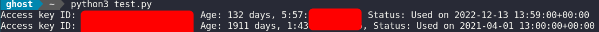

# AWS_IAM_Access_key_checker

This script uses the Boto3 library to check the access keys of all users in an AWS account. It retrieves all IAM users, their access keys, creation dates, and last used dates, and then prints out a summary of the access keys' statuses.

To use this script, you must have the necessary permissions to access IAM resources. You must also have Boto3 installed and configured with AWS credentials.

To run the script, simply execute it in a Python environment with the necessary dependencies installed.

Note that this script only provides a summary of the access keys' statuses and does not make any modifications to the IAM resources.

